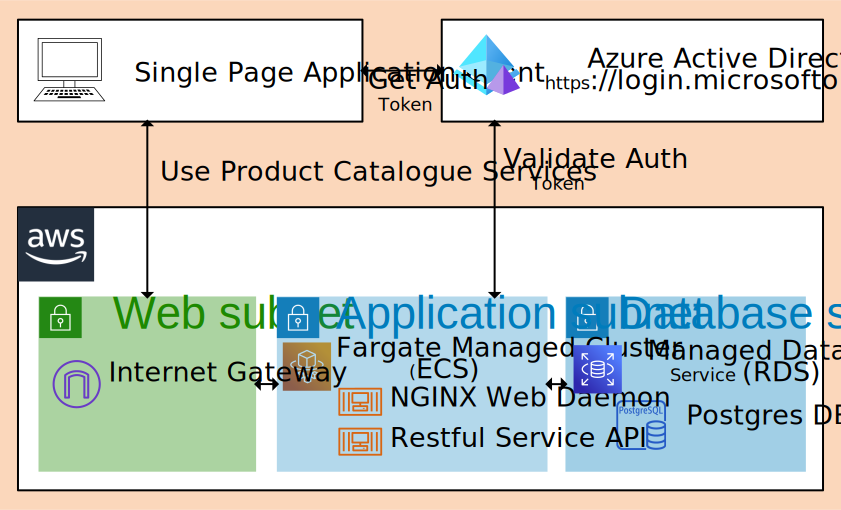
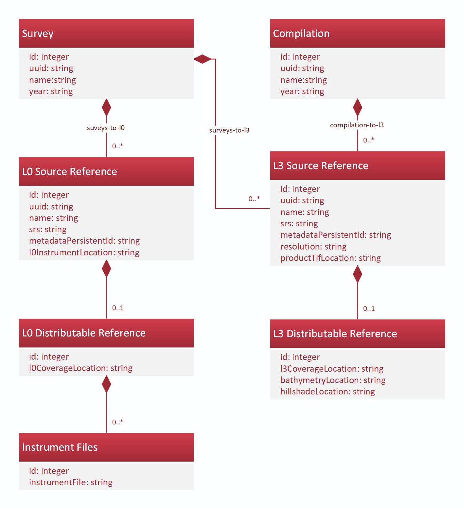

[](https://circleci.com/gh/ausseabed/product-catalogue)

<!-- omit in toc -->
# Contents
- [Introduction](#introduction)
- [Architecture](#architecture)
  - [Product Catalogue Client](#product-catalogue-client)
  - [Product Catalogue Server](#product-catalogue-server)
  - [Data Model](#data-model)
  - [NGINX Setup](#nginx-setup)
- [Continuous Delivery](#continuous-delivery)
  - [Build](#build)
  - [Publish](#publish)
  - [Deploy](#deploy)
  - [How To Deploy to Production](#how-to-deploy-to-production)

# Introduction
The product catalogue tracks bathymetry artefacts of AusSeabed initiative (see [ausseabed](http://ausseabed.gov.au/)). In particular, it records the names and locations of the artefacts and their associated metadata. The system is designed for internal use at Geoscience Australia. The related warehouse facilities (see [warehouse-ogc-webservices](https://github.com/ausseabed/warehouse-ogc-webservices) on github) build interfaces for distributing these products. The product catalogue provides a web app for entering new records, and export to tools such as eCat and the AusSeabed Marine Data portal. 

# Architecture

The main components of the product catalogue are:
* Product Catalogue Client: A Single Page Application hosted through NGINX
* Product Catelogue Server: A Restful Service API to view and update bathymetry records (proxied through NGINX server)
* Postgres Database: Deployed behind the Server, the database houses the records

The components are deployed across local, Amazon Web Services and Azure Active Directory in the following layout:



## Product Catalogue Client
For details see the [Product Catalogue (client)](client/README.md). The Product Catalogue Client is a Single Page Application that provides capabilities to edit information about bathymetry artefacts. It provides a simple data entry/export tool to the product catalogue server/database. It is built with the Quasar/Vue framework and TypeScript/JavaScript. The compiled distributable is a javascript application that is loaded in the browser of the user. 

## Product Catalogue Server
For details see the [Product Catalogue (server)](server/README.md). The Product Catalogue Server provides a RESTful API to view and edit information about bathymetry products. The Product Catalogue Server is built with the NestJS framework in TypeScript. The Object Relational Mapping and Database Migration are orchestrated with TypeOrm. OpenAPI interface descriptions are generated from metadata using NestJS/Swagger plugin.  

The Product Catalogue Server generates an OpenAPI interface document. Using openapi-generator we generate library bindings for:
* TypeScript: rest-client library
* Python: py-rest-client library
* Bash

## Data Model
The intended datamodel is shown below. A Survey/Compilation may comprise one or more Level 3 products. These products must refer to a metadata persistent identifier and a resolvable s3 location for the product GeoTiff. The distributable for each product then contains resolvable locations of processed Cloud Optimised Geotiffs. A Compilation is composed of multiple surveys, but this relation is not represented in the data model (references should be described in the associated metadata). A Survey may also comprise one or more references to Level 0 products. The level 0 product may be composed of a distributable, and that may also be composed of a number of instrument files.



## NGINX Setup
The Product Catalogue Client builds to a Single Page Application (SPA) - something akin to a set of web pages. The SPA is distributed to web users through the NGINX web server. The NGINX web server also acts as a reverse proxy for the Product Catalogue Server API. That is, web-based calls to rest/api are routed to the Product Catalogue Server's express endpoint. 

# Continuous Delivery
The continuous integration server (CircleCI) compiles, publishes and deploys the Product Catalogue to the development environment and production. 

## Build
The sequence of building the product catalogue is:
1. Build Product Catalogue Server
2. Build Product Catalogue Rest API Libraries for TS and Python: create-js-client.sh, create-py-client.sh **(manual step when api changes)**
3. Build Product Catalogue Client

## Publish
The product catalogue is published as two docker containers:
1. NGINX and Product Catalogue Client SPA, that exposes port 3001 (the public port)
2. Product Catalogue Server, that exposes port 3000 (locally referenced from NGINX)

These are published to ECR repository in the non-production infrastructure on any pull to master.

## Deploy
The infrastructure for the product catalogue sits in the [ausseabed-aws-foundation](https://github.com/ausseabed/ausseabed-aws-foundation) github repository. When run, that infrastructure-as-code will build VPC, subnets, internet gateways, an appropriate container cluster, etc. The terragrunt configuration explicitly states which version of the published artefacts should be deployed in the cluster in production (use latest in development).

## How To Deploy to Production
1. Pull required changes from a feature branch to master
2. Test that the changes are acceptable in the development environment
3. Tag the artefacts on master: git tag prod/publish/X.X.X
4. Update the terragrunt version (pcat-app-deployment/terragrunt.hcl)
5. Tag the deployment on master: git tag prod/deploy/X.X.X
6. Approve the deployment on the CI system

Steps 2-5 should be written out in the do_deploy_product_catalogue step of CI server logs. E.g.,
```
git checkout master
git pull
git tag prod/publish/0.0.12
git push origin prod/publish/0.0.12
git push origin prod/deploy/0.0.12

```
then update ausseabed-aws-foundation/pcat-app-deployment/terragrunt.hcl in pcat-app-deployment 
(git clone git@github.com:ausseabed/ausseabed-aws-foundation.git; cd pcat-app-deployment/terragrunt.hcl)
with
```
git checkout master
git pull
git checkout -b pcat-rel/0.0.12
sed -i "s/\(ausseabed-product-catalogue-[a-z]*:\)0.0.11/\10.0.12/" terragrunt.hcl
git add terragrunt.hcl
git commit -m "Update product catalogue version"
git push origin pcat-rel/0.0.12
```
then crete a pull request to master on ausseabed-aws-foundation. And on product catalogue repo, run:

```
git checkout master
git pull
git tag prod/deploy/0.0.12
git push origin prod/deploy/0.0.12
```

Note: The production server will automatically deploy a new task into production by virtue of the ECR image changing. However, in non-production, the existing service will need to be restarted as it won't recognise the new deploy has changed what latest means.
